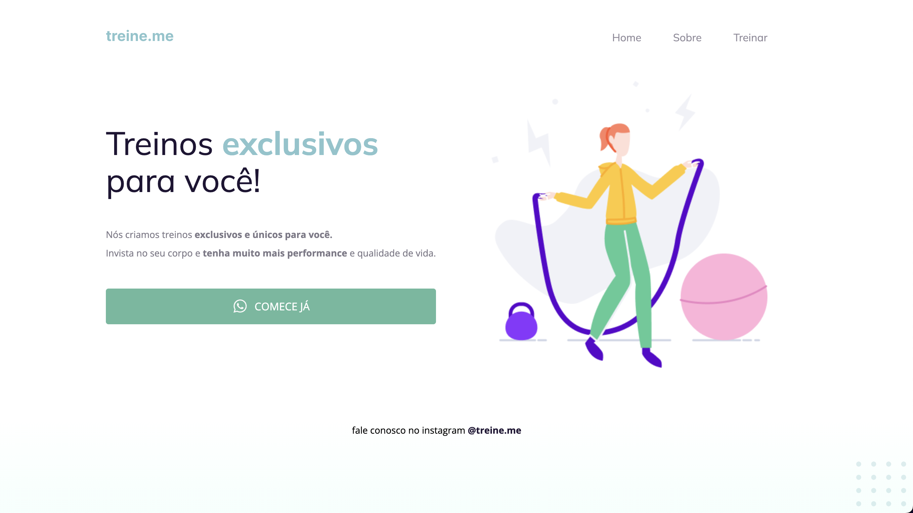
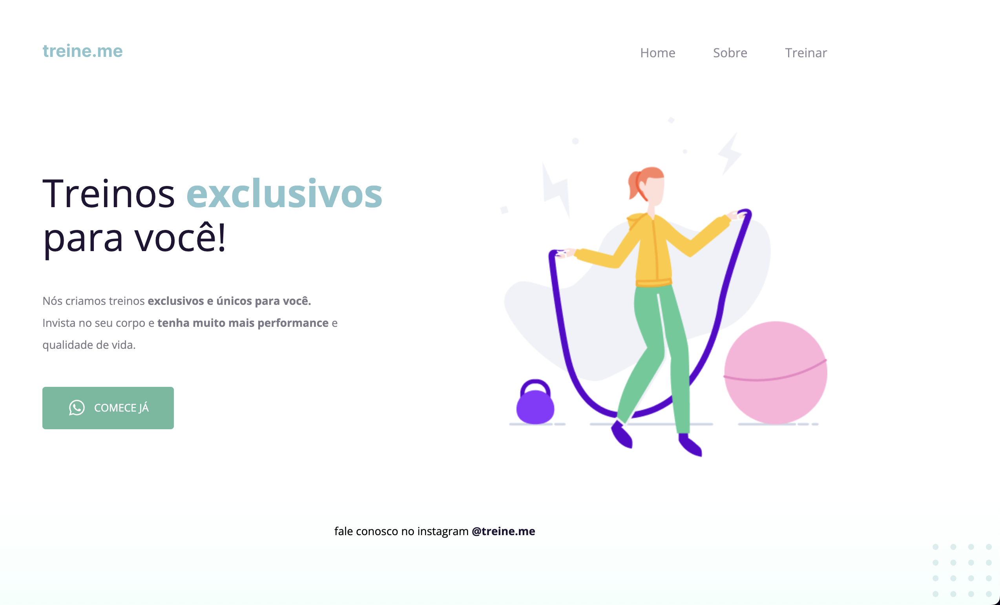

# Desafio 4 - Rocketseat

A ideia do desafio é apresentar uma página que visualmente está toda certa, porém o conteúdo semantico e acessível dela está todo bagunçado, com tags erradas e CSS sendo utilizado para modificar mais do que deveria as caracteristicas semanticas do html.

Ter uma boa estrutura semântica é importante porque, além de facilitar a manutenção técnica, também faz com que leitores de telas e pessoas com algum tipo de deficiência possam utilizar adequadamente o seu site ou produto.

Estrutura inicial:

Resultado:

A ideia é justamente fazer uma refatoração do código, isso é, modificar a estrutura interna para obter um código melhor, porém, sem afetar a estrutura externa. 
